```{r setup, include=T, echo=FALSE}
knitr::opts_chunk$set(echo=FALSE, warning=FALSE, message=FALSE, kfigr.prefix=TRUE, kfigr.link=TRUE, comment=NA)
```

# Introduction

## Cocktail-party problem (Cherry, 1953)

How do we recognize what one person is saying when others are speaking at the same time?

When everyone at a well-attended party talks at the same level, the speech of the attended talker at a distance of 0.7 m has a signal-to-noise ratio (SNR) of about 0 dB (the background is as intense as the target talker Plomp 1977). 
This level is sufficient to give adequate intelligibility for listeners with normal hearing (Miller, 1947).

<center>
{width="35%"}
</center>

## 

- It is well established that hearing capabilities decline with ageing and/or following noise exposure <font size="3">(Vercammen et al. 2018).</font>

- Normal hearing (NH) listeners report great difficulties in understanding speech, particularly, in environments with background noise despite having **normal audiometric thresholds**  <font size="3">(Füllgrabe, Moore, and Stone 2015)</font>
- Animal studies have shown that noise exposure can lead to 40 - 50 \% of loss of AN synapses - **Synaptopathy** <font size="3">(e.g. Kujawa and Liberman, 2015, 2009; Liberman and Kujawa, 2014). </font>
- Histological data seems to confirm this effect in “Normal Hearing” human cochleas <font size="3">(Viana et al., 2015).</font>
- Synaptopathy affect all types of AN fibers: high-SR \/ low- and medium-SR fibers ratio of about 1\:3 <font size="3">(Marmel et al. 2015).</font> 
- Noise exposure may reduce the number of synapses but also induce **transient loss of cochlear Schwann cells resulting in permanent auditory temporal deficits**  <font size="3">(Wan and Corfas 2017)</font>

<center>
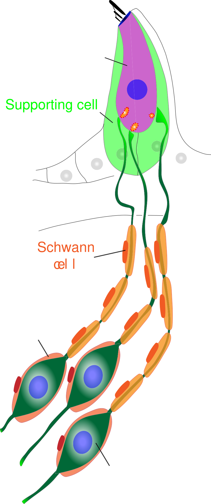{width="8%"}
</center>

## 
<center>
Low frequency cues are particularly sensitive to time.
</center>

<center>
{width="40%"}
</center>

<center>
<font size="3">Bernstein and Trahiotis (2016)</font>
</center>


## Binaural cues

When listening to sounds, we rely on three mechanisms for both sound localization and auditory scene analysis 

<li class ="fragment" data-fragment-index="0"> Interaural level differences (ILDs) </li>

<li class ="fragment" data-fragment-index="1"> Interaural time differences (ITDs) </li>

<li class ="fragment" data-fragment-index="2"> Interaural coherence </li>


## ITDs and ILDs

<center>
{width="60%"}
</center>

# Binaural processing and speech understanding

## Binaural Redundancy

- Loudness doubles when the two ears are used instead of one ear for a sound coming from the front of the listener (a single ear would require an increase of about 10 dB; Fletcher and Munson, 1933)

- Just noticeable differences in intensity and frequency improve with signal redundancy

- Speech recognition in the presence of background noise improves (Marrone 2008, Neher 2009)

- Hearing impairment may lead to a slightly weaker binaural benefit in patients  (Dillon, 2001)

- Sounds presented binaurally can be louder than with a monaural presentation without causing discomfort (even true for CI-treated patient)

## Binaural Release from Masking (or Binaural Squelch; or Hirsh effect)


<li class="fragment" data-fragment-index="2"> Binaural release from masking may improve detection threshold up to about 16 dB for frequencies around 250 Hz and around 3 dB at 1500 Hz </li>

## Spatial Release from Masking  

<center>


</center>

<li class="fragment" data-fragment-index="2"> 
Binaural release from masking may improve detection thresholds up to 12 dB for multiple speech interferers <font size="3">(Jones and Litovsky, 2011)</font>, and facilitates source segregation provided that streaming can build up and natural onset cues are present <font size="3">(Drennan, Gatehouse, and Lever, 2003).</font>
</li>

<li class="fragment" data-fragment-index="3"> 
Segregation is always better for the combination of both ITDs and ILDs cues <font size="3">(Culling, Hawley, and Litovsky 2004)</font>
</li>

<li class="fragment" data-fragment-index="4"> 
A separation of only 10° between two voices is already strong enough to allow segregation  <font size="3">(Brungart and Simpson, 2007).</font>
</li>

<li class="fragment" data-fragment-index="5"> ITD is a critical spatial cue for sound localization and speech perception in noise <font size="3">(Bronkhorst &
Plomp, 1988; Wightman & Kistler, 1992).</font>
</li>


# Auditory Pathway

##

<center>
Input to one ear
</center>

<center>
{width="45%"}
</center>
<center>
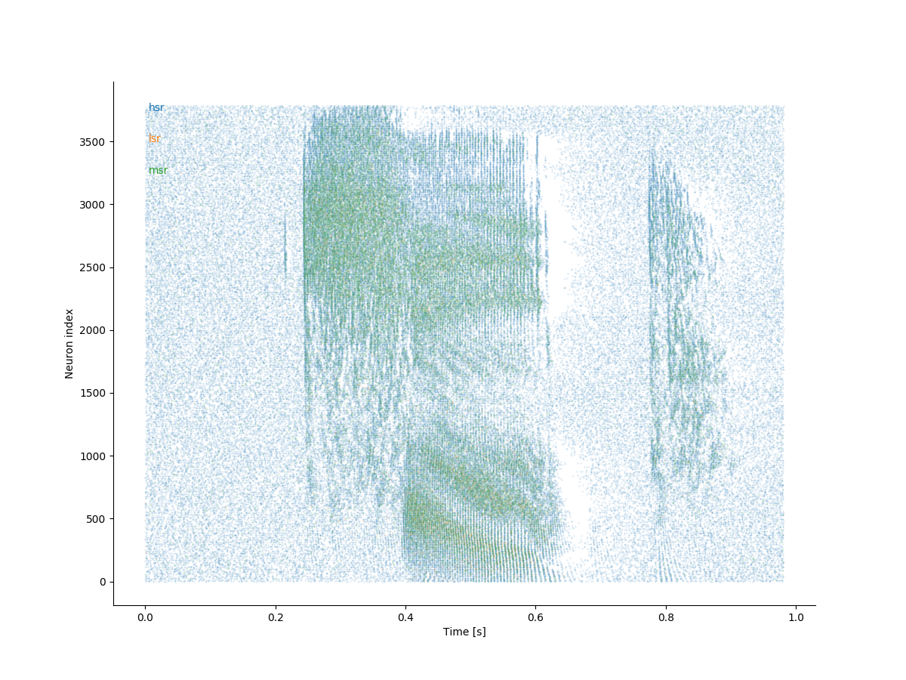{width="45%"}
</center>


## Auditory pathway

<center>
{width="45%"}
</center>


## ITD pathway

<center>
{width="80%"}
</center>

<center>
(Grothe et al. 2010)
</center>

- The initial site of ITD processing is considered to be the MSO.


## Interaural-phase Modulation Following Response (IPM-FR)

Objective measures of binaural processing can be obtained by using stimuli where the temporal fine structure is manipulated so that the perceived location of the sound image changes periodically (e.g. 6.7 Hz) over time. 

<center>
{width="40%"}
<video width="320" height="240" controls source src="./my_figures/example-90.0_90.0.mp4" type="video/mp4">
</center>

<center>
(Undurraga et al. 2016)
</center>

<!-- ##  Interaural-phase modulation (Humans) -->

<!-- - The size of the interaural phase difference (relative ITD with respect to the frequency of the sound) will determine the lateralization of the sound. -->

<!-- <br> -->

<!-- |||| -->
<!-- |-|-|-| -->
<!-- |<video width="320" height="240" controls source src="./my_figures/example-90.0_90.0.mp4" type="video/mp4">| <video width="320" height="240" controls source src="./my_figures/example-45.0_45.0.mp4" type="video/mp4">|<video width="320" height="240" controls source src="./my_figures/example-22.5_22.5.mp4" type="video/mp4">| -->

## Behavioural vs. Objective measures (Humans)

<center>
{width="100%"}
</center>
<center>
(Undurraga et al. 2016)
</center>

- The correlation between objective and behavioural measurements is excellent (r = 0.96)

## The effect of age and hearing loss in objective binaural measures

<center>
{width="30%"}
{width="60%"}
</center>

<center>
Vercammen et al. (2018)
</center>

- Binaural processing of low frequency sounds is significantly deteriorated by age and hearing status.

- A larger IPM-FR dynamic range was associated with lower (better) IPD discrimination.


## Aims

**Does binaural brain response relate to speech-in-noise?**

- To investigate the relation between neural coding of temporal processing using objective (Electroencephalogram (EEG)) and behavioural (speech-in-noise listening) binaural measures in NH listeners.


# Methods

## Preliminary Subjects Assessment

- 23 Participants took part in this study 

**All participants undergone:**

- Otoscopy (to ensure integrity of external ear and tympanic membrane)
- Pure tone audiometry (hearing threshold between 250 Hz – 8 kHz) 
- Immittance test with acoustics reflex (to ensure integrity of middle ear and lower brainstem pathways)
- Distortion product otoacoustic emissions between 500 Hz – 10 kHz (DPOAEs, to assess outer hair cell functioning)


## Behavioural Measures

**Digits in noise test**

- Adaptive staircase procedure (2-down/1-up) with variable adaptive step (Leek, 2001; Denys et al. 2019)
- Three randomly chosen digits were presented in background speech shaped noise. 
<center>
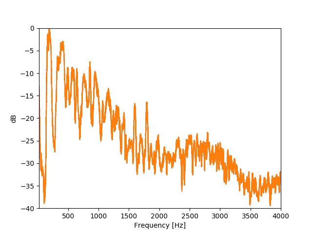{width="60%"}
</center>

##

- Initial step size: 6 dB first two reversals; 3 dB next two reversals, and 2 dB last six reversals.

- Noise was presented diotically (i.e. identical signal in both ears) at 65 dB SPL. 

- Digits were presented using several **ITDs: 0, 0.1, 0.2, 0.4, 0.8 ms**. In addition, digits were also presented having the opposite polarity in both ears - **antiphasic**.

- 3 runs were obtained per ITD (starting SNR at 10 dB and -30 dB).

- All were presented in random order.


## EEG recordings

- Amplitude modulated (80 Hz) bandpass noise (100 - 1000 Hz) at 65 dB SPL.
- Interaural time modulations (ITM) presented at a rate of 6.7 Hz
- ITM consisted of: 0/0 (diotic), 0/0.1 ms, 0/0.2 ms, 0/0.4 ms, 0/0.8 ms, and antiphasic condition.

<center>
{width="80%"}
</center>

## 

- EEG: 64 channels Biosemi system, fs: 16384 Hz.

<center>
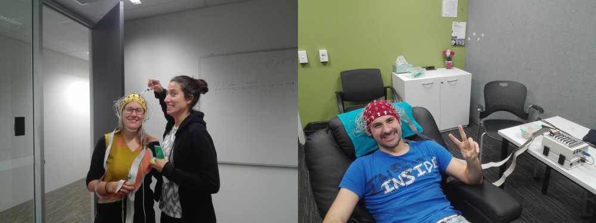{width="80%"}
</center>


## EEG processing

All data was processed with **"pyeeg-python"** (Python 3.7)

- Data referenced to Cz and  down-sampled to 1024 samples per second

- Poor electrode were automatically detected and removed

- Eye blink artifacts were removed using a template matching suppression method <font size="3">(Valderrama et al., 2018)</font>

- Data filtered using a FIR Kaiser filter (−65 dB ripple and 1 Hz transition between pass and stop band)

- Epochs were sorted and de-noised using spatial filtering <font size="3">(de Cheveigné and Simon, 2008)</font>

- Epochs averaged using a weighted averaging method <font size="3"> (Don and Elberling, 1994) </font>

- Frequency response (FFT of 4255 points at 0.24 Hz resolution) and tested using Hotelling’s T-squared test <font size="3"> Picton et al. (1987) and Picton et al. (2003)</font>


# Results

## Screening
<center>
{width="45%"}
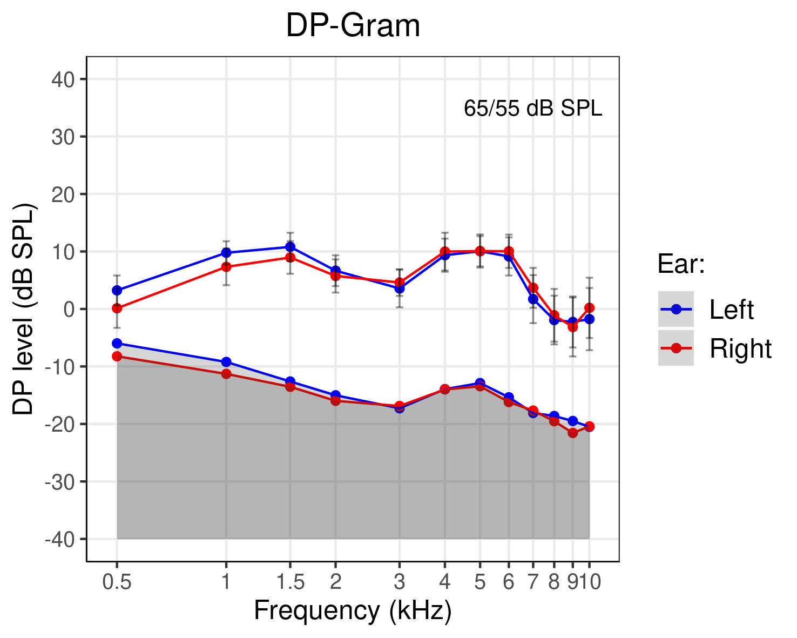{width="45%"}
</center>

## Speech reception thresholds
<center>
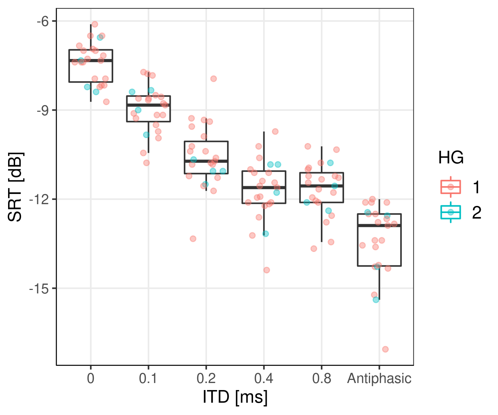{width=45%}
{width=45%}
</center>

- No effect of presentation was no significant (F(5, 352.6) = 1.7, p = 0.14)
- Trial number had a significant effect (difference < **0.88 dB**) (F(2,370.4) = 22.5, p < 0.001)
- SRT improvement ranged between 4.1 and 8.8 dB
- SRT standard deviation increased with ITD (F(5, 105) =  3.7317, p = 0.004). Mean SD: 0.7 (0 ITD) to 1.47 dB (Antiphasic).


## Fishing p-values (the only thing I can go fishing as a vegerarian!)
<center>
{with="100"}
</center>

## SRT vs PTA hearing group (HG): 1 < 20 <= 2

Participants were grouped according to SRTs and PTA - HG: 1 < 20 <= 2

<center>
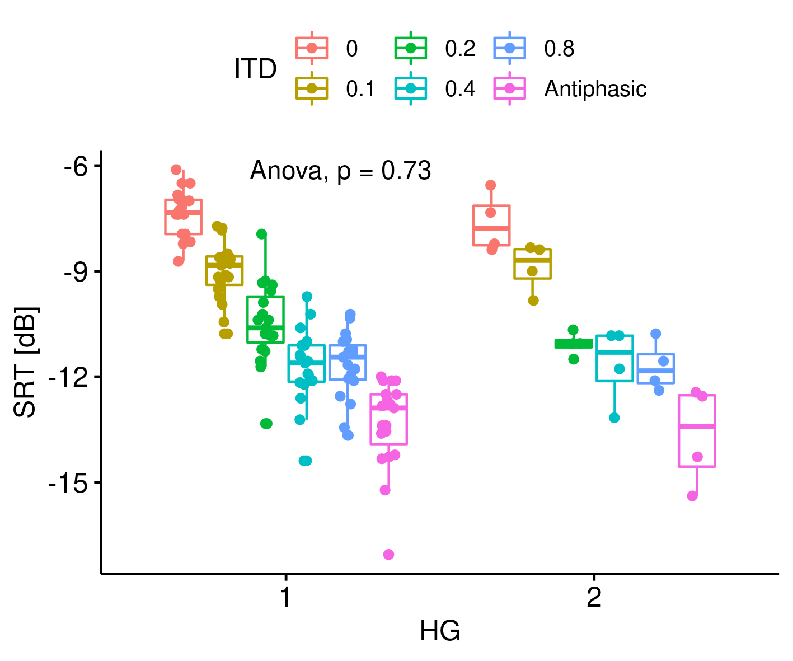{width="40%"}
{width="40%"}
</center>

- SRTs differences between HG1 and HG2 did not differ

## SRT vs PTA low frequency

Participants were grouped according **maximum PTA for frequencies <= 1 kHz and splitted by median**

<center>
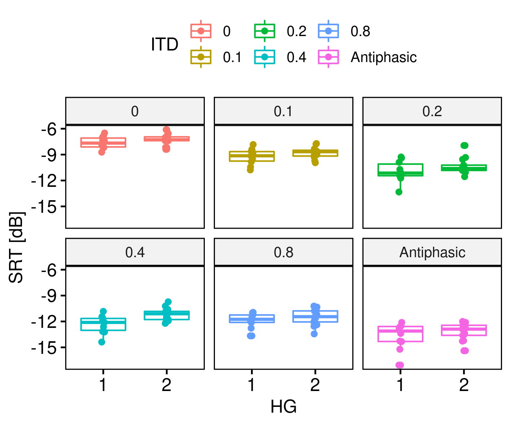{width="40%"}
{width="40%"}
</center>

- HG had a small (0.6 dB) but significant effect (F(1,21) = 4.4271, p = 0.0476).
- Applying the same criteria interaural asymmetry was not significant (p = 0.08).
- Applying the same criteria for frequencies > 1 kHz did not show any significant effect.

## SRT vs DP low frequency

Participants were grouped according **minimum DP for frequencies <= 1 kHz and splitted by median**
<center>
{width="45%"}
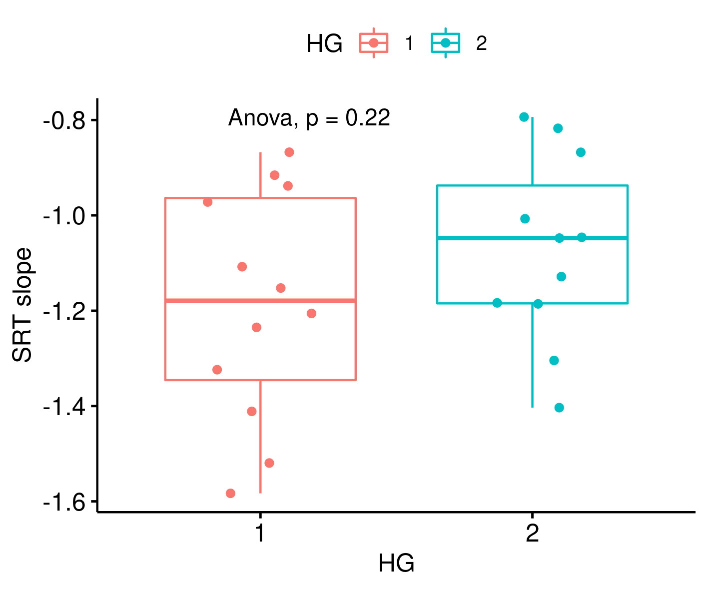{width="45%"}
</center>

- HG had a small (0.6 dB) but significant effect (F(1, 21) = 5.1397, p = 0.034)

## SRT vs DP whole frequency range
Participants were grouped according **maximum binaural DP asymmetry   across all and splitted by median**

<center>
{width="45%"}
</center>

- DP interaural asymmetry grouping show a significant different (p = 0.016).

## EEG responses

<center>
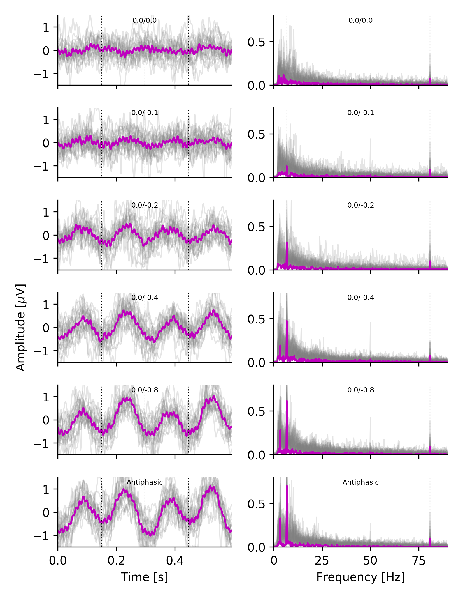{width="50%"}
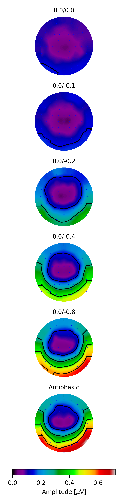{width="15%"}
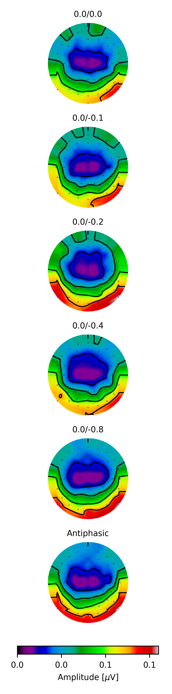{width="15%"}
</center>

## EEG vs stimulus bandwidth 

<center>
{width="45%"}
{width="45%"}
</center>

- ITM-FR no affected by stimulus bandwidth, suggesting that response is mostly elicited by energy below 1 kHz.

##

<center>
{width="45%"}
{width="45%"}
</center>

- ITD-FR significantly affected by ITDs (F(5, 110) = 43.5, p << 0.001)
- ASSR showed no significant effects (F(5, 110) = 1.92, p = 0.09)

## SRT vs EEG

<center>
{width="45%"}
{width="45%"}
</center>

- Best ITM-FR amplitude, SNR or global field power correlate significantly with SRT. 

##

<center>
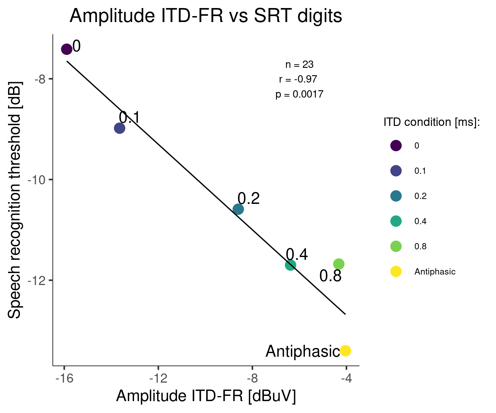{width="45%"}
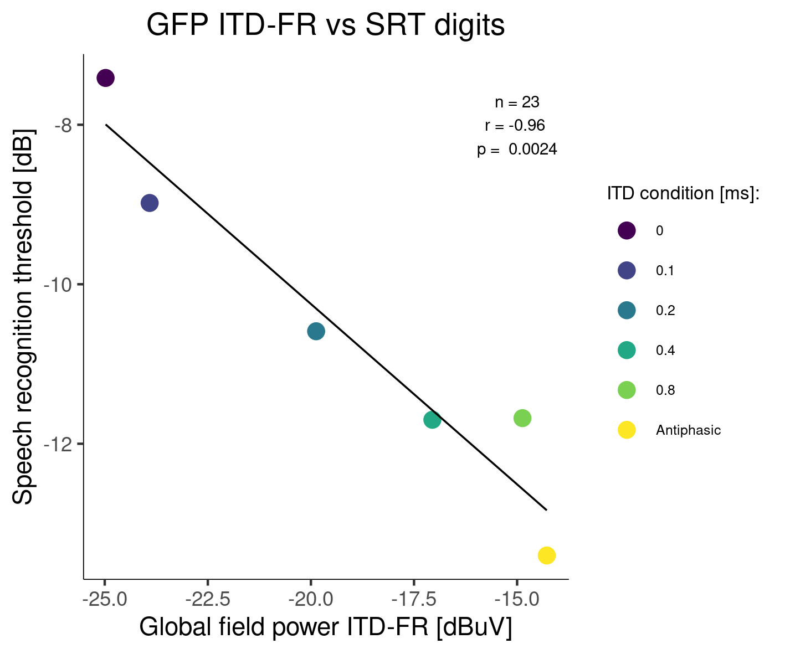{width="45%"}
</center>

- Excellent correlation at group level (-0.43 * ITD-FR Amp dB)
- Good correlations at subject level: **17 (AMP, SNR) - 18 GFP significant correlations**


## Conclusions

- Digits in noise showed reliable and stable SRT (standard deviation across trials was below to 3 dB, and training effects < 1 dB).

- We observed a relatively broad SRT range across participants (4.1 and 8.8 dB) and where within the range observed by other authors.

- Although preliminary, grouping participants based on low frequency PTA and DP seemed to partially explain some of the variance in the SRT scores **(0.6 dB)**, however, remember the **SRT variance:  0.7 (0 ITD) to 1.47 dB (Antiphasic).**

- **EEG responses showed great sensitivity to ITDs** and had an excellent correlation with SRTs (across several different metrics) across and withing participants.

**Future work**

- Obtain predictions from a binaural model combined with several degrees of Synaptopathy / temporal jitter. 

- Repeat experiments with listeners reporting speech-in-noise issues. 
